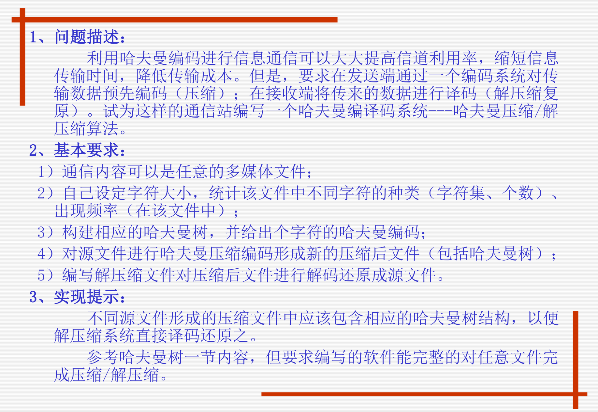

# 实验描述

基于实验需求实现的一个独立
这是本次项目的实现一个结构简图
```
├── huffman_codec_project
│   ├── src
│   │   ├── compressor.cpp
│   │   ├── decompressor.cpp
│   │   ├── huffman_tree.cpp
│   │   ├── utils.cpp
│   ├── include
│   │   ├── compressor.h
│   │   ├── decompressor.h
│   │   ├── huffman_tree.h
│   │   └── utils.h
│   ├── main.cpp
|   ├── sources
│   │   └── (存放测试文件和压缩文件)
│   └── README
```